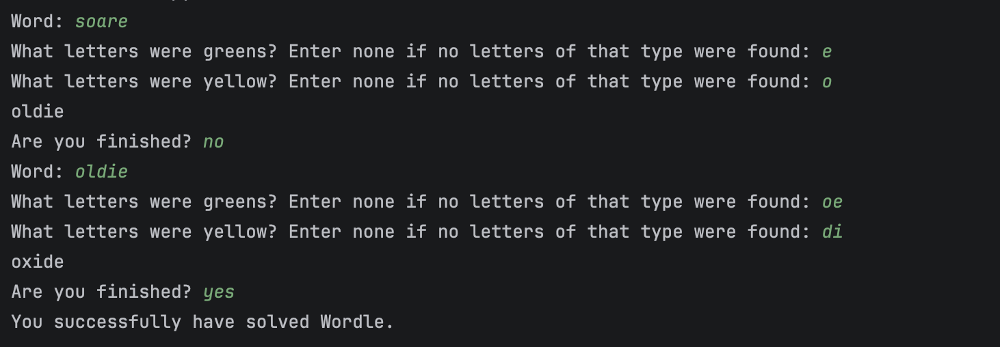
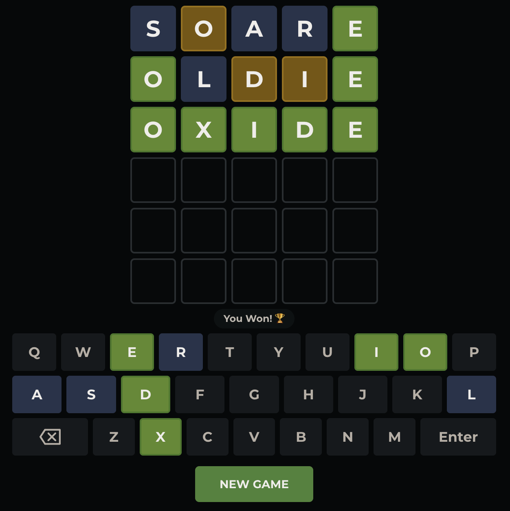

# Wordle Solver 

A command-line argument tool that narrows down possible Wordle answers based on the feedback from each guess.

Wordle is a simple 5-letter word game, where you input words and attempt to find the answer via deduction.

## How it works

    A green letter means: this letter is in the word, at this exact position.
    A yellow letter means: this letter is in the word, but not in this position.
    A grey letter means: this letter is not in the word, at any position.

## Features

- The program automatically finds the grey letters in your word. Meaning, you only have to input the green and yellow letters. Greys are handled for you.
- The total possible word count is shown each turn.
- Filters every word for you
- Simple and easy to understand prompting.  

## Usage

<ol>
  <li>Enter in a word of your choice into Wordle, I will be using 'soare' for this example</li>
  <li>Enter the word and the results of it into the program. For me, only 'o' was yellow, the 'e' was green, and everything else was grey.</li>
  <li>The program returns the best word to guess next. For me, that was 'oldie'</li>
  <li>In 'oldie,' the 'o' and 'e' were green, while the 'd' and 'i' were yellow and 'l' was grey.</li>
  <li>The solver tells me to guess 'oxide' next, which is the correct answer.</li>
  <li>You have solved Wordle.</li>
</ol>

<table>
  <tr>
    <td align="center"><b>Solver</b></td>
    <td align="center"><b>Wordle Output</b></td>
  </tr>
  <tr>
    <td></td>
    <td></td>
  </tr>
</table>

## Requirements

- Python 3.8+
- A word bank (I used the Wordle one on Github)
